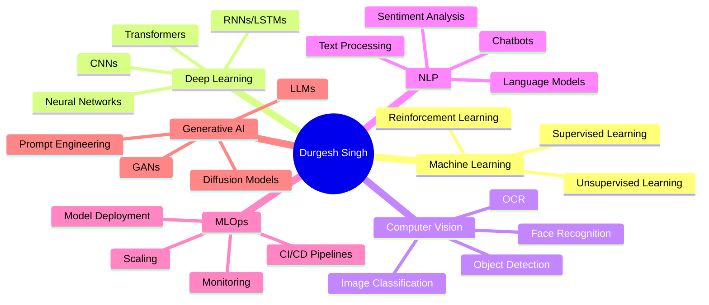

# <div align="center">👋 Hi there, I'm **Durgesh Singh**</div>

<div align="center">
  


</div>

---

## 🚀 About Me


```python
class DataScientist:
    def __init__(self):
        self.name = "Durgesh Singh"
        self.role = "Data Scientist"
        self.location = "India 🇮🇳"
        self.languages = ["Python", "SQL", "R"]
        self.specializations = [
            "Machine Learning", "Deep Learning",
            "Computer Vision", "NLP", "MLOps", "GenAI"
        ]
        
    def say_hi(self):
        print("Thanks for dropping by! Let's build something amazing together!")

me = DataScientist()
me.say_hi()
```

- 🔭 Currently working on **Generative AI** and **MLOps** projects
- 🌱 Learning **Advanced Computer Vision** and **LLM Fine-tuning**
- 👯 Looking to collaborate on **Open Source AI Projects**
- 💬 Ask me about **Machine Learning, Deep Learning, Python**
- 📫 Reach me at: **durgeshsingh12712@gmail.com**
- ⚡ Fun fact: I turn coffee into code and data into insights! ☕➡️💻

---

## 🛠️ Tech Arsenal

<div align="center">

### 🤖 AI/ML Frameworks


### ☁️ Cloud & DevOps


### 🗄️ Databases


### 🌐 Web Technologies


</div>

---

## 📊 GitHub Analytics

<div align="center">
  


</div>

<div align="center">
  


</div>

---

## 🏆 GitHub Trophies

<div align="center">
  


</div>

---

## 🎯 Current Focus Areas

<div align="center">



</div>

---

## 📈 Contribution Activity

<div align="center">
  


</div>

---

## 🌟 Featured Projects

<div align="center">

[](https://github.com/Durgeshsingh12712/End-to-End-Book-Recommanded-System)
[](https://github.com/Durgeshsingh12712/End-to-End-Network-Security-For_Phising-Project)

</div>

---

## 🤝 Let's Connect!

<div align="center">
  
[](https://linkedin.com/in/your-linkedin)
[](https://twitter.com/your-twitter)
[](mailto:durgeshsingh12712@gmail.com)
[](https://your-portfolio.com)

</div>

---

<div align="center">
  
### 💫 "Turning Data into Stories, Code into Solutions"


</div>

---

<div align="center">
  
**Thanks for visiting! 🚀**


</div>
